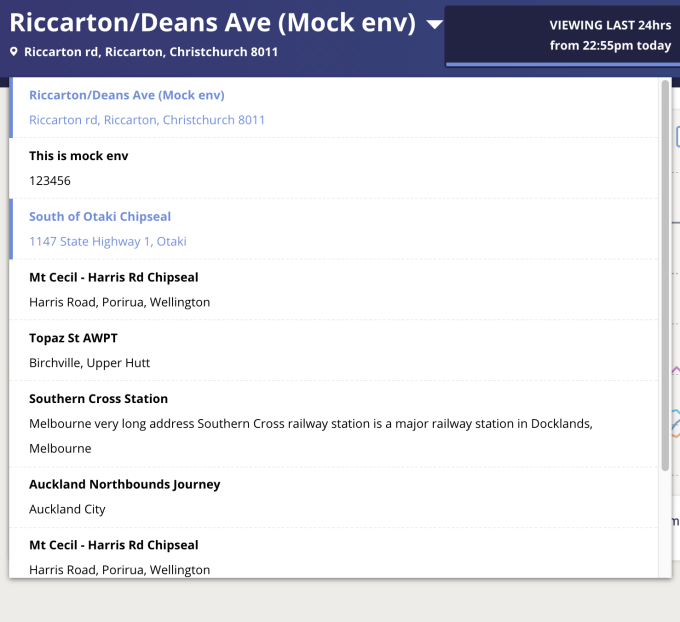
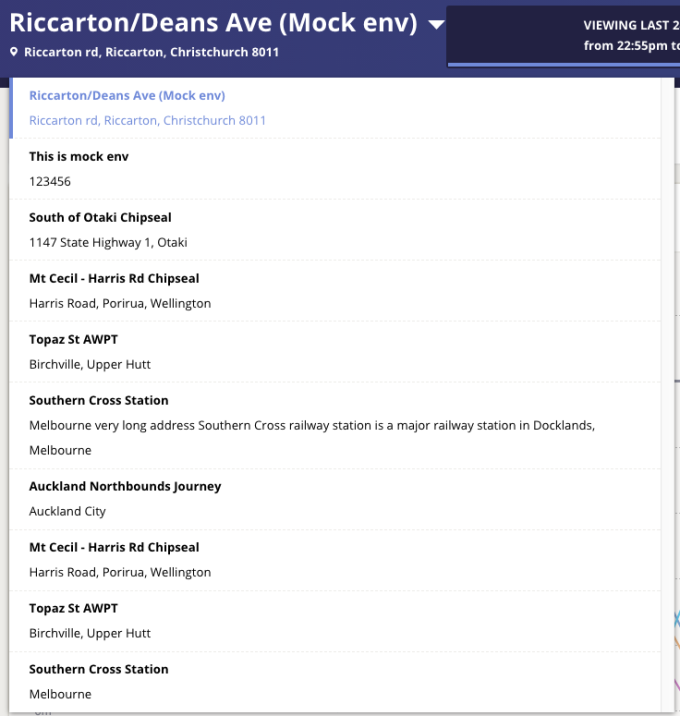

We have a list insides a parent container. We want parent container's height to grow as much as possible to avoid a scrollbar to be shown. 

For example, we want the scroll bar to display on a small screen (e.g. 13' Macbook Air 1440 px x 900px) when the content breaks out its bound:



When user's screen is on a large device, and there is enough space for all items to be displayed, then the scrollbar should be hidden.



It is straight forward to implement this with css, just use `overflow-y` and  `max-height` properties to define scrollbar to appear at height 70px.

```css
overflow-y: scroll;
max-height: 70px;
```

With the help of media query, we can make sure the max-height value scale according to screen size. But I have found a new way to set the max-height dynamically depending on user's device, the new way is through use of the view port units.

## Viewport and Viewport Units
The viewport is the user's visible area of a web page. Viewport size can be tricky on mobile browsers. Apple has invented the "viewport meta tag" to allow the viewport to be configurable. However we are going to focus on destop browser in today's scope.

The view port units - `vw`, `vh`, `vmin`, and `vmax` - work similarly to existing length units like px or em, but represent a percentage of the current browser viewport.
